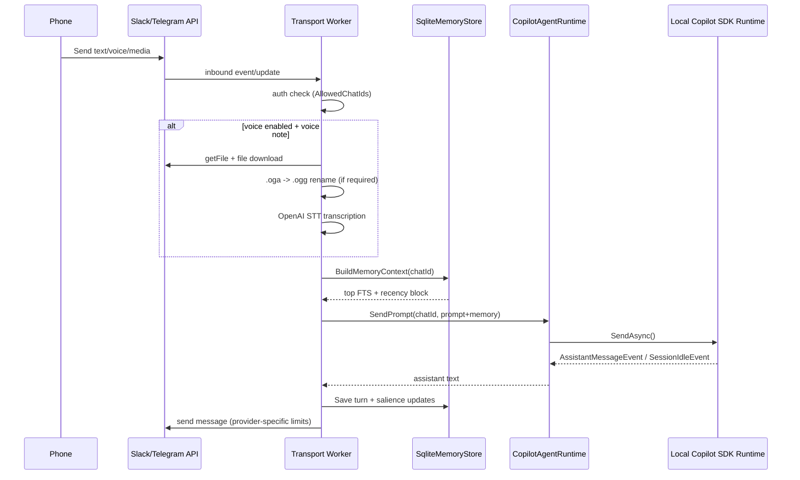

# El Rucio Architecture

## Project Status
- This is currently a hobby project with a single active user/maintainer.
- Backward compatibility is a low priority for now.
- Aggressive refactors are acceptable, including breaking changes, when they simplify architecture or improve maintainability.

## Selection Summary
- Platform: slack (default), telegram supported
- Voice: stt_openai
- Memory: full
- Optional: scheduler, video, service
- Preflight defaults in use: socket mode for slack provider, telegram polling for telegram provider, Microsoft.Data.Sqlite + raw SQL migrations, console-first host, env vars + appsettings, bounded HTTP retry, .oga->.ogg rename path.
- Only what you chose. Nothing extra.

## Components & Responsibilities
- ElRucio.Host
  - Generic Host bootstrapping, DI registration, options validation, service wiring.
  - Runs background workers (Telegram polling, scheduler, salience decay).
- ElRucio.Platform
  - Slack Socket Mode transport (default) and Telegram transport (long polling).
  - Shared command routing and response handling via inbound processor + command service.
  - OpenAI STT integration and media download handling.
  - OpenAI video/image analyzer with stub fallback.
- ElRucio.Agent
  - Thin wrapper over GitHub Copilot SDK (`CopilotClient`, `CreateSessionAsync`, `ResumeSessionAsync`, `SendAsync`, `SessionIdleEvent`).
  - Per-chat runtime session map with persistent `chat_id -> session_id` mapping.
- ElRucio.Memory
  - SQLite bootstrap + migrations.
  - Full-memory implementation (semantic/episodic sectors, FTS5 search, salience updates/decay).
  - Session map persistence, approval queue persistence, scheduled task persistence.
- ElRucio.Scheduler
  - Cron polling loop and due task execution.
- ElRucio.Shared
  - Options, enums, DTOs, interfaces.

## Sequence Diagram


## File Tree
```text
src/
  ElRucio.Host/
    Program.cs
    appsettings.json
    Workers/
      ServiceInstallerHostedService.cs
      SalienceDecayHostedService.cs
  ElRucio.Platform/
    Telegram/
      TelegramPollingService.cs
      TelegramApiClient.cs
      TelegramModels.cs
      TelegramHtmlFormatter.cs
    Voice/
      OpenAiSpeechToText.cs
    Video/
      VideoAnalyzerStub.cs
    Orchestration/
      ChatOrchestrator.cs
  ElRucio.Agent/
    CopilotAgentRuntime.cs
  ElRucio.Memory/
    Sqlite/
      SqliteDbInitializer.cs
      SqliteSessionStore.cs
      SqliteMemoryStore.cs
      SqliteApprovalStore.cs
      SqliteScheduledTaskStore.cs
  ElRucio.Scheduler/
    SchedulerWorker.cs
  ElRucio.Shared/
    Options/
    Contracts/
    Models/
test/
  ElRucio.Memory.Tests/
    UnitTest1.cs
  ElRucio.Platform.Tests/
    CopilotRuntimeE2eTests.cs
    InboundChatProcessorTests.cs
    InMemoryTransportHarnessTests.cs
    SchedulingIntegrationTests.cs
    SlackApiClientTests.cs
    SlackDedupTests.cs
    SlackDefaultConfigurationTests.cs
    SlackSocketEnvelopeFixtureTests.cs
    SlackSocketEnvelopeParserTests.cs
    UnitTest1.cs
```

## Threat Model Lite
- Unauthorized bot control
  - Risk: unknown chat sends commands.
  - Mitigation: `AllowedChatIds` gate before processing.
- Prompt injection via media content
  - Risk: malicious attachment content changes behavior.
  - Mitigation: prepend trusted system guardrails and isolate memory block markup.
- Risky tool execution
  - Risk: destructive operations.
  - Mitigation: conservative risk detector + local approval queue (`/approve`, `/cancel`).
- Secret leakage
  - Risk: tokens written to logs.
  - Mitigation: never log full tokens, options validated, secure env overrides.
- Unbounded retries / API storms
  - Risk: provider instability amplifies traffic.
  - Mitigation: fixed timeout and bounded retries for HTTP provider calls.
